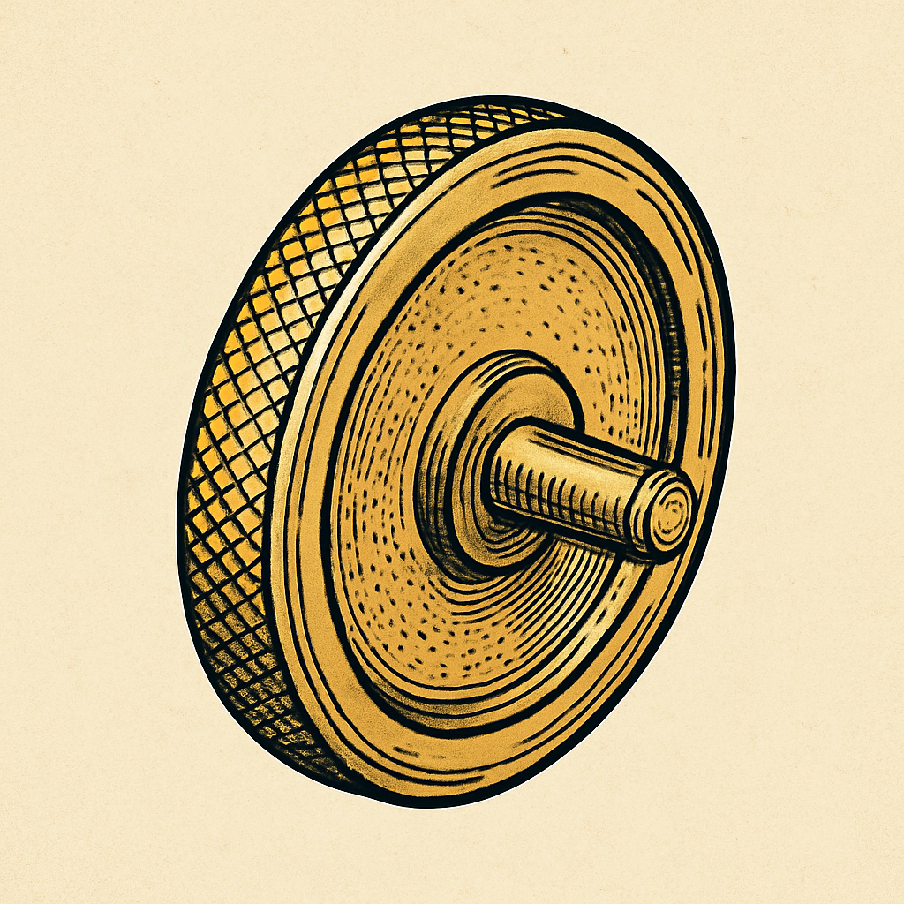

# FlywheelControl

[](https://swiftpackageindex.com/aweiner42/FlywheelControl)
[](https://swiftpackageindex.com/aweiner42/FlywheelControl)

A tactile, momentum-based radial control for SwiftUI — inspired by analog flywheels.  


A SwiftUI-based, physics-inspired radial scroller for zooming, scrubbing, and precision value adjustments.  
**FlywheelControl** mimics the feel of a real-world dial — complete with momentum, resistance, haptic feedback, and **pen-friendly input**.

---

## 🌀 Why FlywheelControl?

We needed a more natural way to zoom — something better than pinch and expand.  
So we built a **rotary-style control** that works with a **finger or stylus**, and feels real thanks to physics and CoreHaptics.

---

## ✨ Features

- 🎛️ Inertial spinning like a physical dial  
- 📱 One-finger- and **Apple Pencil-friendly**  
- 💥 Haptic ticks for tactile feedback  
- 🎨 Fully SwiftUI and easy to customize  
- 🧠 Decoupled: just emits `delta` values — you decide what to do with them  
- 🚀 Smooth momentum decay and natural stopping behavior  
- 🎨 Custom skin support: Apply your own ruler artwork for a fully branded experience  
- 🛑 Clamp limits: minValue and maxValue must be > 0
- 📏 spanCM defines visible range (must be > 0)

---

## 📦 Installation

### Swift Package Manager

**In Xcode:**

1. Go to `File → Add Packages…`  
2. Enter the URL: `https://github.com/aweiner42/FlywheelControl`  
3. Choose the latest version (e.g., `1.1.0`)

**Or add it to your `Package.swift`:**

```swift
.package(url: "https://github.com/aweiner42/FlywheelControl.git", from: "1.1.0")
```

Then add the dependency to your target:

```swift
.target(
    name: "YourApp",
    dependencies: ["FlywheelControl"]
)
```

Import the module where needed:

```swift
import FlywheelControl
```

### 🖼 Adding a Custom Skin

Place your ruler artwork (e.g., `RulerSkin.png`) in your app’s Asset Catalog (`Assets.xcassets`) and assign it the name `RulerSkin`. FlywheelControl will automatically load this image if present.

The package includes a sample ruler skin (`DefaultRuler.png`). You can copy it into your app’s Asset Catalog and rename it `RulerSkin` for immediate use.

---

## 🎯 Example Integration

```swift
FlywheelControl(
    minValue: -150,  // Negative ranges are supported
    maxValue: 150,
    spanCM: 20        // Must be > 0
) { delta in
    zoomManager.adjustZoom(by: delta)
}
```

---

## 🔧 Requirements

- iOS 17.0+  
- macOS 12.0+  
- Swift 5.9+  
- SwiftUI + Combine

---

## 🧪 Previews & Tests

FlywheelControl includes:

- 🔍 SwiftUI Previews  
- 🧱 Modular design (no app dependencies)

---

## 🔄 Try It Live

Clone this repo and open `FlywheelDemoApp/FlywheelDemoApp.xcodeproj` to explore the latest refinements including improved momentum physics and control skinning.

---

## ✍️ Created by

Alan Weiner • [SIME Corp](https://simecorp.net)    
Inventor. Designer. Engineer. Collaborating with AI to shape intuitive interfaces.

Version 1.1.0 includes performance tuning, refined gesture handling, and support for custom ruler skins with clamped value ranges.
